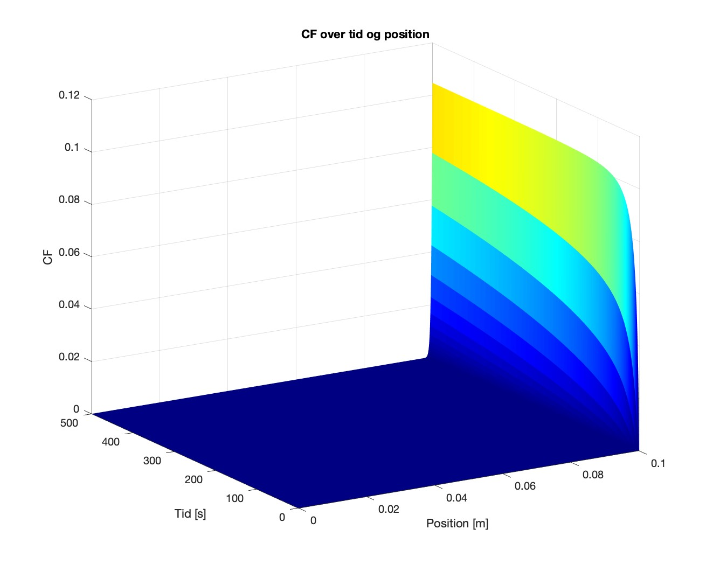

# Solute Transport Computation On Membranes
![Matlab Version][matlab-image] ![Topic][topic-image] ![Uni.][AAU-image] ![ECTS.][ECTS-image] ![LIC][LIC-image]
> A Membrane-based Process Modeling Simulation Using Emperical Numerical Methods
---
<details>
  <summary><strong>Show Creators Of Project:</strong></summary

                                                       
## **Project Creators:** <br />

Axelsen, D. A. L., <br />
Galsøe, P., <br />
Hansen, J. A., <br />
Mølgaard, J. S., <br />
Rehné, A. M., <br />
Zegarra, L. K., <br />

</details>

## Table of contents
* [General info](#general-info)
* [Key incorporated theoretical aspects](#Key-incorporated-theoretical-aspects)
* [Mathematical methodology](#Mathematical-methodology)
* [Installation](#Installation)
* [Simulation results](#Simulation-results)
* [Use cases](#Use-cases)


## General info
A chemistry tool for modeling solute molecules transport through a membrane. It uses data from a Visual MINTEQ simulation of a solution where equilibrium has transpired.

### Key incorporated theoretical aspects
* Advections
  * Solute addvection
  * Percipitate addvection
* Convection
* Percipitate suspension
* Indirect equilibrium Incorporation  *(From MINTEQ)*
* pH specification  *(From MINTEQ)*
* Osmotic pressure
* Solute Accumulation
* Fouling
* Conservation of mass investigation


### Mathematical methodology
The concept is an emperical numerical method based on the generalized advection-diffusion equation.
<!-- This content will not appear in the rendered Markdown -->

The movement equation of the emperical model is solved numerically as a finite difference explicit upwind scheme in accordance to the forward Euler method as:

$$c_{i,j}=c_{i,j-1}+ D \frac{(c_{i+1,j-1}-2c_{i,j-1}+c_{i-1,j-1})}{\Delta x^2}\Delta t - J_{tot,v} \frac{(c_{i,j-1}-c_{i-1,j-1})}{\Delta x} \Delta t$$


#### Bountary Conditions
The boundary conditions is defined as follows:

$$
c_{L_x,j}-c_{L_x,j-1}=D(\frac{c_{L_x+\Delta x,j-1}-c_{L_x,j-1}}{\Delta x^2}+\frac{c_{L_x,j-1}+c_{L_x-\Delta x,j-1}}{\Delta x^2})\Delta t - J_{tot,v}\frac{(c_{L_x,j-1}\cdot (1-\sigma_i)-+c_{L_x-\Delta x,j-1})}{\Delta x}\Delta t
$$

#### Stability
> [!TIP]
> Stability indicators for diffusion and advection are in the console and plot, respectively.

The diffusive and advective stabilities is defined in isolated enviorments by the following conditions:

$$D\frac{\Delta t}{\Delta x^2} \leq \frac{1}{2}  ~~~ And ~~~  J_{tot,v}\frac{\Delta t}{\Delta x} <1$$ 
And
$$J_{tot,v}\frac{\Delta t}{\Delta x} <1$$

While in a system where both of these stabilities are relevant a new term must be upheld:

$$1-J_{tot,v}\frac{\Delta t}{\Delta x} - 2D\frac{\Delta t}{\Delta x^2} \geq 0$$


## Installation
OS X & Windows: 
```
git clone https://github.com/Andemanden/Computational-Solute-Transport-Across-Membranes.git
```
Linux:
```
git clone https://github.com/Andemanden/Computational-Solute-Transport-Across-Membranes.git --depth 1 --branch=master ~/dir-name
```
**Current MATLAB version:** <br />
**[MathWorks Page](https://se.mathworks.com/help/install/ug/install-products-with-internet-connection.html)**

**Visual MINTEQ:** <br />
**[The MINTEQ Page](https://vminteq.com/download/)**

## Simulation Results
> Pictures to be added
<!-- Pictrue is not from report -->


## Use cases
This code has already been used in this article: [^1] <br />


## Current progress
Progress: [======================] 100%


[^1]: [Membrane-based Process Modeling of Phosphorus Recovery from the Danish Sewage Sludge Using Numerical Methods](https://kbdk-aub.primo.exlibrisgroup.com/permalink/45KBDK_AUB/a7me0f/alma9921650701005762)


<!-- Markdown link & img dfn's -->
[matlab-image]: https://img.shields.io/badge/LNG-MATLAB_23.2-orange
[topic-image]: https://img.shields.io/badge/Topic-Integrated_Process_Modeling-green
[AAU-image]: https://img.shields.io/badge/Uni-AAU-blue
[ECTS-image]: https://img.shields.io/badge/ECTS-15-red
[LIC-image]: https://img.shields.io/badge/LIC-CC_BY--NC--SA-brown
